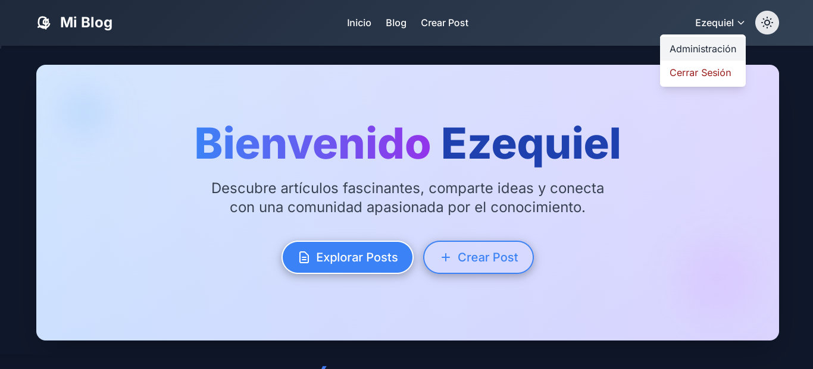
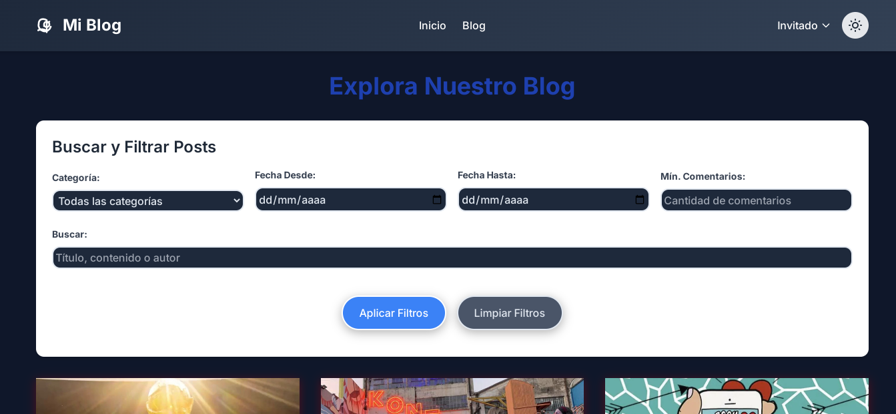

# Blog con Python + Django (Informatorio - Chaco)

Este repositorio contiene el proyecto desarrollado para el curso de Desarrollo Web del Informatorio. Se trata de una aplicación web completamente funcional, construida desde cero utilizando Python y el framework Django.

---

## ✨ Características:

* **Roles de Usuario:** Administrador, Usuario Registrado, Visitante (comentarista).
* **Gestión de Posts:** Crear, editar, eliminar posts (con permisos basados en roles).
* **Comentarios:** Usuarios registrados pueden comentar posts.
* **Autenticación:** Login, registro y logout de usuarios.
* **Panel de Administración:** Panel robusto de Django para gestión de contenido y usuarios.
* **Filtrado de Posts:** Por fecha, categoría y cantidad de comentarios.

---

## 📷 Capturas de pantalla

  
  
  

---

## ⚙️ Configuración y Ejecución Manual:

1.  **Clonar el repositorio o extraer el ZIP/RAR:**
    ```bash
    git clone https://github.com/EzequielEdOjeda/Blog_Django.git
    ```
    (O simplemente extrae el contenido del archivo comprimido en una carpeta)

2.  **Crear un entorno virtual (recomendado):**
    ```bash
    python -m venv entorno
    ```

3.  **Activar el entorno virtual:**
    * **Windows:** `entorno\Scripts\activate`
    * **macOS/Linux:** `source entorno/bin/activate`

4.  **Instalar dependencias dentro de `mi_blog`:**
    ```bash
    cd Blog_Django/mi_blog
    pip install -r requirements.txt
    ```

5.  **Aplicar migraciones de la base de datos:**
    ```bash
    python manage.py makemigrations && python manage.py migrate
    ```

6.  **Crear un superusuario (administrador):**
    ```bash
    python manage.py createsuperuser
    ```
    Sigue las instrucciones para crear un usuario administrador.

7.  **Ejecutar el servidor de desarrollo:**
    ```bash
    python manage.py runserver
    ```

8.  **Acceder al Blog:**
    * Abre tu navegador y ve a `http://127.0.0.1:8000/`.
    * Panel de Administración: `http://127.0.0.1:8000/admin/` (usa las credenciales del superusuario).

---

## 🖥️ Instalación rápida en PC

Si estás en Windows, puedes usar los archivos incluidos:

1. Ejecuta `Instalación.bat` para instalar los requisitos automáticamente.
2. Luego ejecuta `RunServer.bat` para iniciar el servidor.
3. Accede desde tu navegador a: [http://127.0.0.1:8000](http://127.0.0.1:8000)

---

## ☁️ Despliegue en PythonAnywhere

Puedes instalar el proyecto en [PythonAnywhere](https://www.pythonanywhere.com/) siguiendo estos pasos desde su consola Bash:

1. Clona el repositorio:
    ```bash
    git clone https://github.com/EzequielEdOjeda/Blog_Django.git
    cd Blog_Django
    ```

2. Crea el entorno virtual:
    ```bash
    mkvirtualenv --python=/usr/bin/python3.10 venv
    cd mi_blog
    pip install -r requirements.txt
    pip install mysqlclient
    ```

3. Edita el archivo `wsgi.py` en la sección **Code:** WSGI configuration file:
    ```python
    import os
    import sys

    path = os.path.expanduser('/home/NOMBREGITHUB/Blog_Django/mi_blog')
    if path not in sys.path:
        sys.path.insert(0, path)

    os.environ['DJANGO_SETTINGS_MODULE'] = 'mi_blog.settings'

    from django.core.wsgi import get_wsgi_application
    from django.contrib.staticfiles.handlers import StaticFilesHandler

    application = StaticFilesHandler(get_wsgi_application())
    ```

4. Configura en `settings.py`:
    ```python
    DEBUG = False
    ALLOWED_HOSTS = ['NOMBREGITHUB.pythonanywhere.com']
    ```

> También puedes consultar este video guía:  
> 🎥 [Instalación en PythonAnywhere](https://www.youtube.com/watch?v=M5ZQjVbtSa8)

### Configuración Manual en PythonAnywhere

Dentro de tu cuenta de PythonAnywhere, aplica los siguientes ajustes:

#### 🔧 Sección **Code**:
- **Source code**:  
  `/home/NOMBREGITHUB/Blog_Django/mi_blog`

- **Working directory**:  
  `/home/NOMBREGITHUB/`

#### 📦 Sección **Virtualenv**:
-  
  `/home/NOMBREGITHUB/.virtualenvs/venv`

#### 🗂️ Sección **Static files**:

| URL       | Directory                                               |
|-----------|---------------------------------------------------------|
| `/static/` | `/home/NOMBREGITHUB/Blog_Django/mi_blog/static`         |
| `/media/`  | `/home/NOMBREGITHUB/Blog_Django/mi_blog/media`          |

#### 🔐 Sección **Security**:
- **Force HTTPS**: Activa esta opción (Enabled)

#### 🛢️ Sección **Databases**:
- Crea una base de datos MySQL y asigna una contraseña segura.

#### 🔁 Sección **Reload**:
- Presiona el **botón verde de recarga** para aplicar los cambios y listo.

---

## 📁 Roles y Permisos:

* **Admin:** Puede crear, editar, eliminar posts y usuarios, asignar roles.
* **Usuario Registrado:** Pueden comentar posts.
* **Visitante:** Puede leer los posts pero no puede comentar.

---

## 🚀 Tecnologías Utilizadas

* **Backend:** Python, Django  
* **Base de Datos:** SQLite 3  
* **Frontend:** HTML5, CSS3, Tailwind CSS  
* **Gestión de Dependencias:** Pip, `requirements.txt`  
* **Control de Versiones:** Git, GitHub

---

## 👤 *Desarrollador del Proyecto*

* **EzequielEdOjeda** - [🔗 Ver Más Proyectos en mi GitHub](https://github.com/EzequielEdOjeda)

---

## ⭐ ¡No olvides darle una estrella si te gustó este proyecto!
