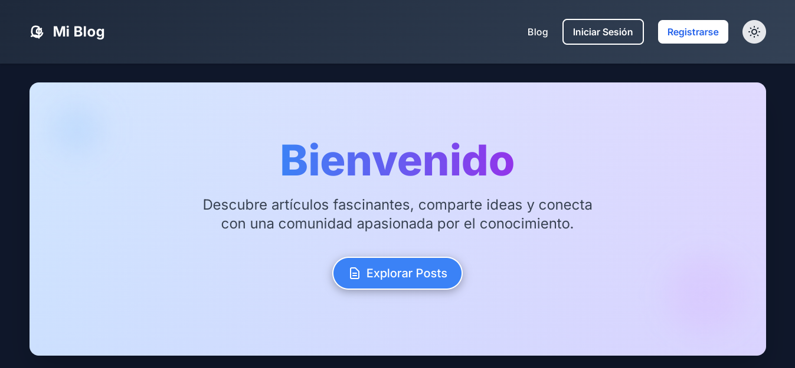
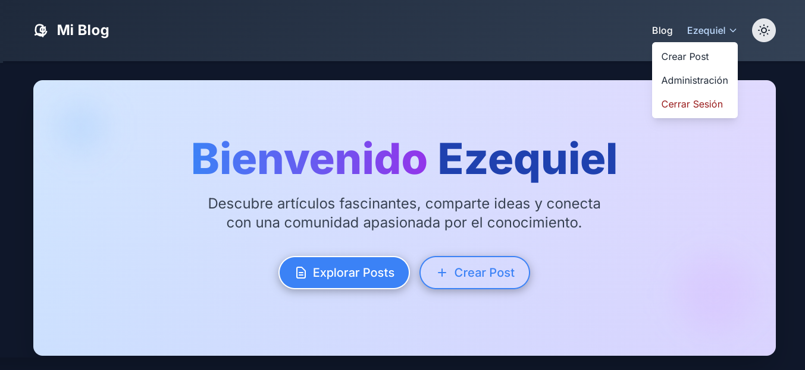

# Blog con Python + Django (Informatorio - Chaco)

Este repositorio contiene el proyecto desarrollado para el curso de Desarrollo Web del Informatorio. Se trata de una aplicación web completamente funcional, construida desde cero utilizando Python y el framework Django.

---

## ✨ Características:

* **Roles de Usuario:** Administrador, Usuario Registrado, Visitante (comentarista).
* **Gestión de Posts:** Crear, editar, eliminar posts (con permisos basados en roles).
* **Comentarios:** Usuarios registrados pueden comentar posts.
* **Autenticación:** Login, registro y logout de usuarios.
* **Panel de Administración:** Panel robusto de Django para gestión de contenido y usuarios.
* **Filtrado de Posts:** Por fecha, categoría y cantidad de comentarios.

---

## 📷 Capturas de pantalla


<br></br>

<br></br>

---

## ⚙️ Configuración y Ejecución:

1.  **Clonar el repositorio o extraer el ZIP/RAR:**
    ```bash
    git clone https://github.com/EzequielEdOjeda/Blog_Django.git
    ```
    (O simplemente extrae el contenido del archivo comprimido en una carpeta)

2.  **Crear un entorno virtual (recomendado):**
    ```bash
    python -m venv entorno
    ```

3.  **Activar el entorno virtual:**
    * **Windows:** `entorno\Scripts\activate`
    * **macOS/Linux:** `source entorno/bin/activate`

4.  **Instalar dependencias dentro de mi_blog:**
    ```bash
    pip install -r requirements.txt
    ```

5.  **Aplicar migraciones de la base de datos:**
    ```bash
    python manage.py makemigrations && python manage.py migrate
    ```

6.  **Crear un superusuario (administrador):**
    ```bash
    python manage.py createsuperuser
    ```
    Sigue las instrucciones para crear un usuario administrador.

7.  **Ejecutar el servidor de desarrollo:**
    ```bash
    python manage.py runserver
    ```

8.  **Acceder al Blog:**
    * Abre tu navegador y ve a `http://127.0.0.1:8000/`.
    * Panel de Administración: `http://127.0.0.1:8000/admin/` (usa las credenciales del superusuario).

---

## 📁 Roles y Permisos:

* **Admin:** Puede crear, editar, eliminar posts y usuarios, asignar roles.
* **Usuario Registrado:** Pueden comentar posts.
* **Visitante:** Puede leer los posts pero no puede comentar.

---

## 🚀  Tecnologías Utilizadas

* **Backend:** Python, Django
* **Base de Datos:** SQLite 3 
* **Frontend:** HTML5, CSS3, Tailwind CSS
* **Gestión de Dependencias:** Pip, `requirements.txt`
* **Control de Versiones:** Git, GitHub

---

## 👤 *Desarrollador del Proyecto*

* **EzequielEdOjeda** / [Ver Más Proyectos](https://github.com/EzequielEdOjeda)

---

## No olvides darle ⭐ a este repositorio si te gustó.
